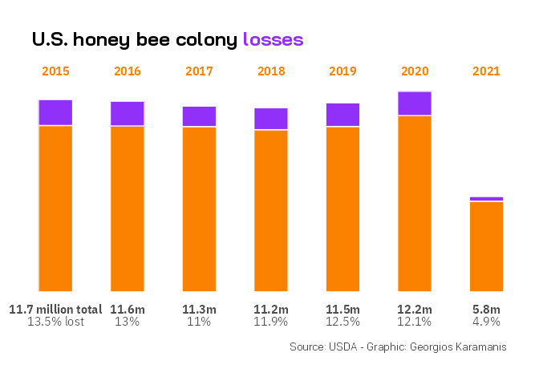
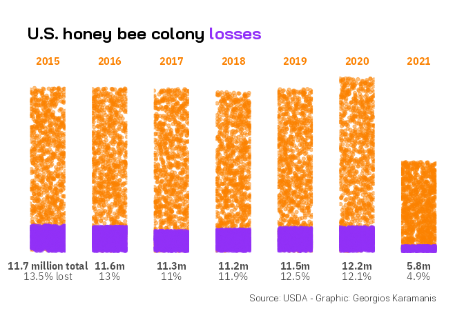

VizBuzz 02
================
Tan Ho
2022-03-08

``` r
suppressPackageStartupMessages({
  library(tidyverse)
  library(tantastic)
  library(ggthemes)
  library(ggtext)
  library(gridtext)
  library(ggbeeswarm)
  # library(usmap)
  # library(ggVennDiagram)
})
```


``` r
colony <- read.csv("colony.csv")


x <- colony |> 
  filter(state == "United States") |>
  group_by(year) |> 
  summarise(
    colony_n = sum(colony_n, na.rm = TRUE),
    colony_max = sum(colony_max, na.rm = TRUE),
    colony_lost = sum(colony_lost, na.rm = TRUE),
    x = colony_lost / colony_n
    ) 
```

``` r
purple <- "#9130F8"
orange <- "#FB8100"

x <- tibble(
  year = 2015:2021,
  total = c(11.7,11.6, 11.3, 11.2, 11.5, 12.2, 5.8),
  pct = c(0.135,.13,.11,.119,.125,.121,.049)
) |> 
  mutate(
    lost = total * pct,
    kept = total - lost,
    pct = NULL,
    total = NULL
  ) |> 
  pivot_longer(c(kept,lost), names_to = "type") |> 
  mutate(
    fill = case_when(type == "kept" ~ orange,
              type == "lost" ~ purple),
    text = case_when(
      year == "2015" ~ "<strong>11.7 million total</strong><br>13.5% lost",
      year == "2016" ~ "<strong>11.6m</strong><br>13%",
      year == "2017" ~ "<strong>11.3m</strong><br>11%",
      year == "2018" ~ "<strong>11.2m</strong><br>11.9%",
      year == "2019" ~ "<strong>11.5m</strong><br>12.5%",
      year == "2020" ~ "<strong>12.2m</strong><br>12.1%",
      year == "2021" ~ "<strong>5.8m</strong><br>4.9%"
    )
  )

x |> 
ggplot(aes(x = text, y = value, fill = fill)) +
  geom_col(color = "white",width = 1) +
  scale_fill_identity() +
  theme_uv() +
  # theme_bw() +
  theme(plot.title = element_markdown(),
        axis.title = element_blank(),
        axis.line = element_blank(),
        axis.ticks = element_blank(),
        axis.text.x = element_markdown(size = 12),
        axis.text.y = element_blank(),
        axis.title.x = element_blank(),
        axis.title.y = element_blank(),
        axis.ticks.x = element_blank(),
        panel.grid.major = element_blank(), 
        panel.grid.minor = element_blank(),
        plot.caption = element_text(color = "#333333", size = 10),
        strip.text = element_text(colour = orange,hjust = 0.5, size = 12,face = "bold")
        
        ) +
  
  facet_wrap(vars(year), nrow = 1, scales = "free_x",) +
  labs(
    title = "U.S. honey bee colony <span style = 'color:#9130F8'>losses</span>",
    caption = "Source: USDA - Graphic: Georgios Karamanis"
  )+ 
  NULL
```

<!-- -->

``` r
x |> 
  mutate(
    x = map(value, ~runif(1000,0,.x))
  ) |> 
  unnest(x) |> 
ggplot(aes(x = year, y = x, color = fill)) +
  geom_jitter(width = 1, height = 0, alpha = 0.5) +
  # geom_pointrange()
  scale_color_identity() +
  theme_uv() +
  # theme_bw() +
  theme(plot.title = element_markdown(),
        axis.title = element_blank(),
        axis.line = element_blank(),
        axis.ticks = element_blank(),
        axis.text.x = element_markdown(size = 12),
        axis.text.y = element_blank(),
        axis.title.x = element_blank(),
        axis.title.y = element_blank(),
        axis.ticks.x = element_blank(),
        panel.grid.major = element_blank(), 
        panel.grid.minor = element_blank(),
        plot.caption = element_text(color = "#333333", size = 10),
        strip.text = element_text(colour = orange,hjust = 0.5, size = 12,face = "bold")
        
        ) +
  
  facet_wrap(vars(year), nrow = 1, scales = "free_x",) +
  labs(
    title = "U.S. honey bee colony <span style = 'color:#9130F8'>losses</span>",
    caption = "Source: USDA - Graphic: Georgios Karamanis"
  )+ 
  NULL
```

<!-- -->
