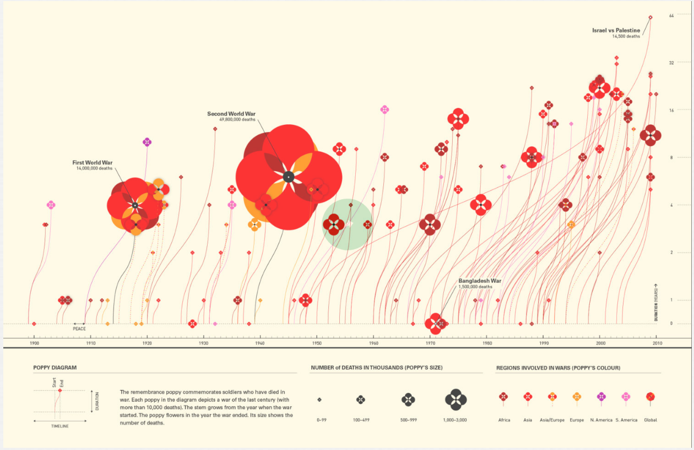

```{r setup}
knitr::opts_chunk$set(echo = TRUE, dev = "ragg_png")
suppressPackageStartupMessages({
  library(tidyverse)
  # library(tantastic)
  library(nflplotR)
  library(ggforce)
  # library(ggimage)
  # library(gridtext)
  # library(ggtext)
  # library(ggthemes)
  # library(ggtext)
  # library(gridtext)
  # library(ggbeeswarm)
  # library(paletteer)
  # library(ggbeeswarm)
  # library(usmap)
  # library(ggVennDiagram)
  # library(ggridges)
})

```

## Vizbuzz 03



```{r import}
dat <- read_csv("wars_since_1900.csv") |> 
  separate(Years, into = c("start","end"),sep = " - ",convert = TRUE) |> 
  mutate(duration = end - start,
         fatalities = Fatalities/1000) |> 
  filter(fatalities > 1)

colours <- list(
  beige = "#FFFAE7"
)

link_to_img <- function(x = "poppy.png", width) {
  glue::glue("")
}

```

```{r plot}
dat |>
  # mutate(image = map(fatalities/10, ~link_to_img("poppy.png",width = .x))) |> 
  ggplot(aes(x = end, y = duration)) + 
  geom_curve(aes(x = start, xend = end, y = 1, yend = duration), 
             size = 0.4,curvature = 0.2, color = "red", alpha = 0.2) +
  # geom_richtext(aes(label = image), alpha = 0.5) + 
  geom_point(aes(size = fatalities),alpha = 0.85, color = "red") +
  # geom_image(color = "red") +
  scale_size_continuous(range = c(1,25)) +
  scale_x_continuous(breaks = seq(1900,2010,by = 10)) +
  # scale_size_continuous(range = c(0.05,0.5)) +
  scale_y_continuous(trans = "log2",breaks = c(0,1,2,4,7,16,32,64),position = "right") +
  theme_minimal() +
  theme(
    plot.background = element_rect(fill = colours$beige, colour =  NA),
    panel.background = element_rect(fill = colours$beige, colour =  NA),
    legend.background = element_rect(fill = colours$beige, colour =  NA),
    panel.grid.major.x = element_blank(),
    panel.grid.major.y = element_blank(),
    panel.grid.minor.x = element_blank(),
    panel.grid.minor.y = element_blank(),
    legend.key = element_rect(fill= colours$beige, colour =  NA),
    legend.position = "bottom",
    axis.title.x = element_blank()
  ) + 
  labs(y = "Duration", size = "Number of Deaths in Thousands")
```


```{r plot2}
dat |>
  mutate(scaled_fatalities = round(Fatalities/1000),
         scaled_fatalities = scaled_fatalities/max(scaled_fatalities,na.rm = T),
         scaled_fatalities = scaled_fatalities * 0.20 + 0.025) |> 
  ggplot(aes(x = duration + 1, y = end, size = Fatalities/1000)) + 
  geom_diagonal(aes(y = start, yend = end, x = 1, xend = duration + 1.01),color = "red",alpha = 0.2,inherit.aes = FALSE)+
  geom_point(aes(size = fatalities),shape = 18, alpha = 0.25, color = "red") +
  geom_from_path(aes(height = scaled_fatalities,
                     width = scaled_fatalities),
                 path = "poppy.png",
                 alpha = 0.95) + 
  scale_size_continuous(range = c(1,20),
                        breaks = c(1000,2000,3000,4000,5000),
                        guide = guide_legend(title.position = "top")) +
  scale_y_continuous(breaks = seq(1900,2010,by = 10)) +
  scale_x_continuous(trans = "log2",
                     breaks = c(1,2,4,8,16,32,64),
                     position = "top"
  ) +
  coord_flip() +
  theme_minimal() +
  theme(
    plot.background = element_rect(fill = colours$beige, colour =  NA),
    panel.background = element_rect(fill = colours$beige, colour =  NA),
    legend.background = element_rect(fill = colours$beige, colour =  NA),
    panel.grid.major.x = element_blank(),
    panel.grid.major.y = element_blank(),
    panel.grid.minor.x = element_blank(),
    panel.grid.minor.y = element_blank(),
    legend.key = element_rect(fill= colours$beige, colour =  NA),
    legend.position = "bottom",
    axis.title.x = element_blank()
  ) + 
  labs(x = "Duration", size = "Number of Deaths in Thousands")
```

