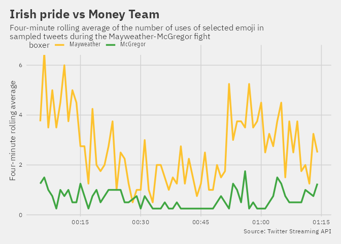

VizBuzz 04
================
Tan Ho
2022-03-22

``` r
suppressPackageStartupMessages({
  library(tidyverse)
  library(tantastic)
  library(emoji)
  library(slider)
  # library(nflplotR)
  
  library(ggthemes)
  # library(paletteer)

  # library(ggridges)
  # library(ggtext)
  # library(gridtext)
  # library(ggbeeswarm)
  # library(usmap)
  # library(ggVennDiagram)
  
  # library(patchwork)
  # library(cowplot)
  
  knitr::opts_chunk$set(dev = 'ragg_png')
})
```

# Goal Viz


What are the easy wins here?

-   Title
-   Subtitle
-   Colours
-   Axis breaks

``` r
tweets <- read_csv("tweets.csv")
```

    ## New names:
    ## * `` -> ...1

    ## Rows: 12118 Columns: 8

    ## -- Column specification --------------------------------------------------------
    ## Delimiter: ","
    ## chr  (3): link, screen_name, text
    ## dbl  (2): ...1, id
    ## lgl  (2): emojis, retweeted
    ## dttm (1): created_at

    ## 
    ## i Use `spec()` to retrieve the full column specification for this data.
    ## i Specify the column types or set `show_col_types = FALSE` to quiet this message.

``` r
mcgregor_emotes <- c("shamrock",
                     "flag_Ireland",
                     "four_leaf_clover")

mayweather_emotes <- c("money_mouth_face",
                       "moneybag",
                       "money_with_wings",
                       "dollar")

emotes <- emoji::emojis |> 
  unnest(aliases) |> 
  filter(aliases %in% c(mcgregor_emotes, mayweather_emotes)) |> 
  mutate(
    boxer = c(rep("McGregor",3), rep("Mayweather",4))
  ) |> 
  select(emoji,boxer)

tweet_parse <- tweets |> 
  mutate(
    emojis = emoji::emoji_extract_all(text)
  ) |> 
  unnest(emojis) |> 
  dplyr::inner_join(emotes, by = c("emojis"="emoji")) |> 
  distinct(id, .keep_all = TRUE) |> 
  mutate(created_at = lubridate::floor_date(created_at,"minute")) |> 
  group_by(boxer,
           created_at) |> 
  summarise(
    count = n() 
  )
```

    ## `summarise()` has grouped output by 'boxer'. You can override using the `.groups` argument.

``` r
annotations <- list(
  "Fight begins",
  "McGregor does OK in early rounds",
  "Mayweather takes \n over and wins by \nTKO"
)
```

``` r
mayweatherlabels <- map_chr(mayweather_emotes,emoji) |> paste(collapse = "")
macgregorlabels <- map_chr(mcgregor_emotes,emoji) |> paste(collapse = "")

tweet_parse |> 
  ggplot(aes(x = created_at, y = count/4, color = boxer)) + 
  geom_line(size = 1.2) +
  # geom_smooth(size = 1.2, se = FALSE, method = "loess",) +
  scale_color_manual(
    values = c("Mayweather" = "#FDC22E","McGregor"="#40A642"),
    # labels = c("Mayweather" = mayweatherlabels, "McGregor"= macgregorlabels)
  ) + 
  scale_x_datetime() +
  theme_fivethirtyeight(base_family  = "IBM Plex Sans") +
  theme(
    plot.title.position = "plot",
    axis.title.y = element_text(),
    legend.position = c(0.2,1),
    legend.text = ggtext::element_markdown(family = "Noto Sans")
  ) + 
  ylab("Four-minute rolling average") +
  labs(
    title = "Irish pride vs Money Team",
    subtitle = "Four-minute rolling average of the number of uses of selected emoji in\nsampled tweets during the Mayweather-McGregor fight",
    caption = "Source: Twitter Streaming API"
  ) 
```

<!-- -->
