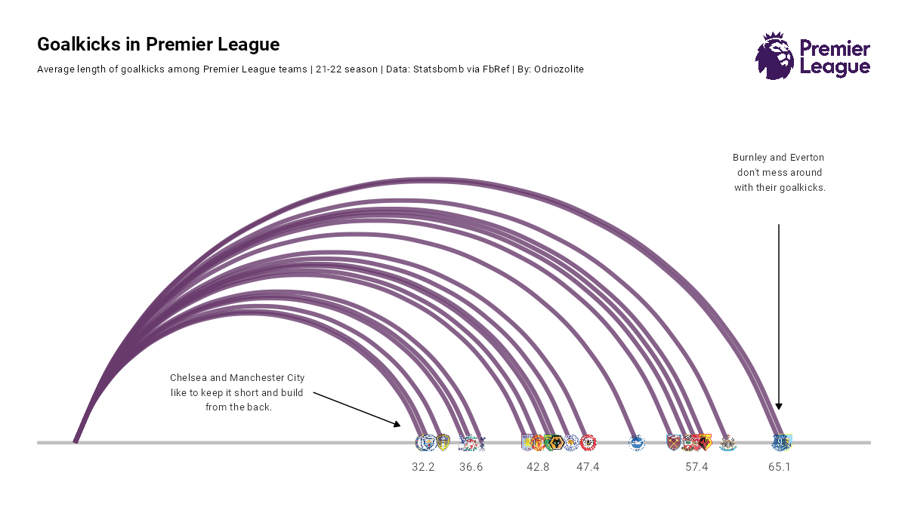

```{r setup}
knitr::opts_chunk$set(echo = TRUE, dev = "ragg_png")
suppressPackageStartupMessages({
  library(tidyverse)
  # library(tantastic)
  library(nflplotR)
  # library(ggthemes)
  # library(ggtext)
  # library(gridtext)
  # library(ggbeeswarm)
  # library(paletteer)
  # library(ggbeeswarm)
  # library(usmap)
  # library(ggVennDiagram)
  # library(ggridges)
})

```

## Vizbuzz 03

<!--  -->

```{r import} 
goalkicks <- read.csv("goalkicks.csv")
```

```{r wrangle}

```

```{r plot,dpi=100}
base_plot <- goalkicks |> 
  ggplot(aes(x = avg_goal_kick_len, path = url_logo_espn)) + 
  geom_hline(yintercept = 0,color = "grey50",size = 1.5, alpha = 0.5)+
  geom_curve(aes(xend = avg_goal_kick_len,y = 0, yend = 0),
             curvature = -0.75, 
             x = 0, 
             color = "#683A6B", 
             alpha = 0.8, 
             size = 2,
             ncp = 10
             ) +
  geom_from_path(y = 0, height = 0.05, width = 0.05, alpha = 0.75) + 
  tantastic::theme_uv(base_family = "Roboto",plot_title_family = "Roboto",subtitle_size = 10) + 
  scale_x_continuous(breaks = c(32.2,36.6,42.8,47.4,57.4,65.1), limits = c(0,70)) + 
  scale_y_continuous(breaks = NULL, limits = c(0,1)) +
  labs(
    title = "Goalkicks in Premier League",
    subtitle = "Average length of goalkicks among Premier League teams | 21-22 season | Data: Statsbomb via FbRef | By: Odriozolite",
    y = NULL
  ) +
  annotate("text", x = 15, y=0.15, label = "Chelsea and Manchester City\nlike to keep it short and build\n from the back.", hjust = 0.5, vjust = 0.5) +
  annotate("text",x = 65, y=0.75,label = "Burnley and Everton\n don't mess around\n with their goalkicks.",
           hjust = 0.5, vjust = 0) +
  annotate("segment",x = 22, y = 0.15, xend = 30, yend = 0.05,color = "black", arrow = arrow(type = "closed", ends = "last", length = unit(.2,"cm"))) +
  annotate("segment",x = 65, y = 0.65, xend = 65, yend = 0.1,color = "black", arrow = arrow(type = "closed", ends = "last",  length = unit(.2,"cm"))) +
  theme(
    # axis.line.x = element_line(color = "grey50",size = 2),
    panel.grid.major.x = element_blank(),
    panel.grid.minor.x = element_blank(),
    panel.grid.major.y = element_blank(),
    panel.grid.minor.y = element_blank(),
    axis.title.x = element_blank()
  ) +
  NULL

# download.file("https://download.logo.wine/logo/Premier_League/Premier_League-Logo.wine.png","epl.png")
logo <- png::readPNG("epl.png", native = TRUE)
final_plot <- base_plot + patchwork::inset_element(logo, 0.8, 0.8, 1, 1, align_to = 'full')

# ggsave("out.png",width = 1202,height = 676,units = "px",dpi = 100)

```


