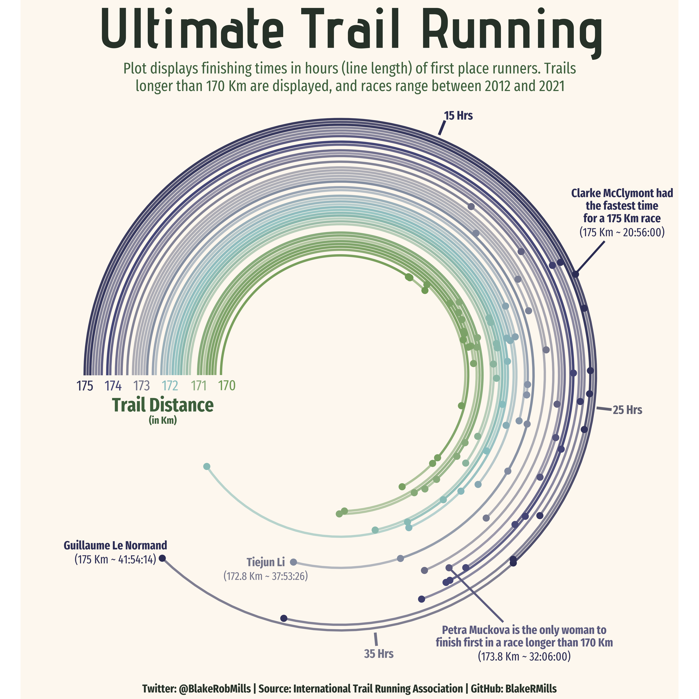
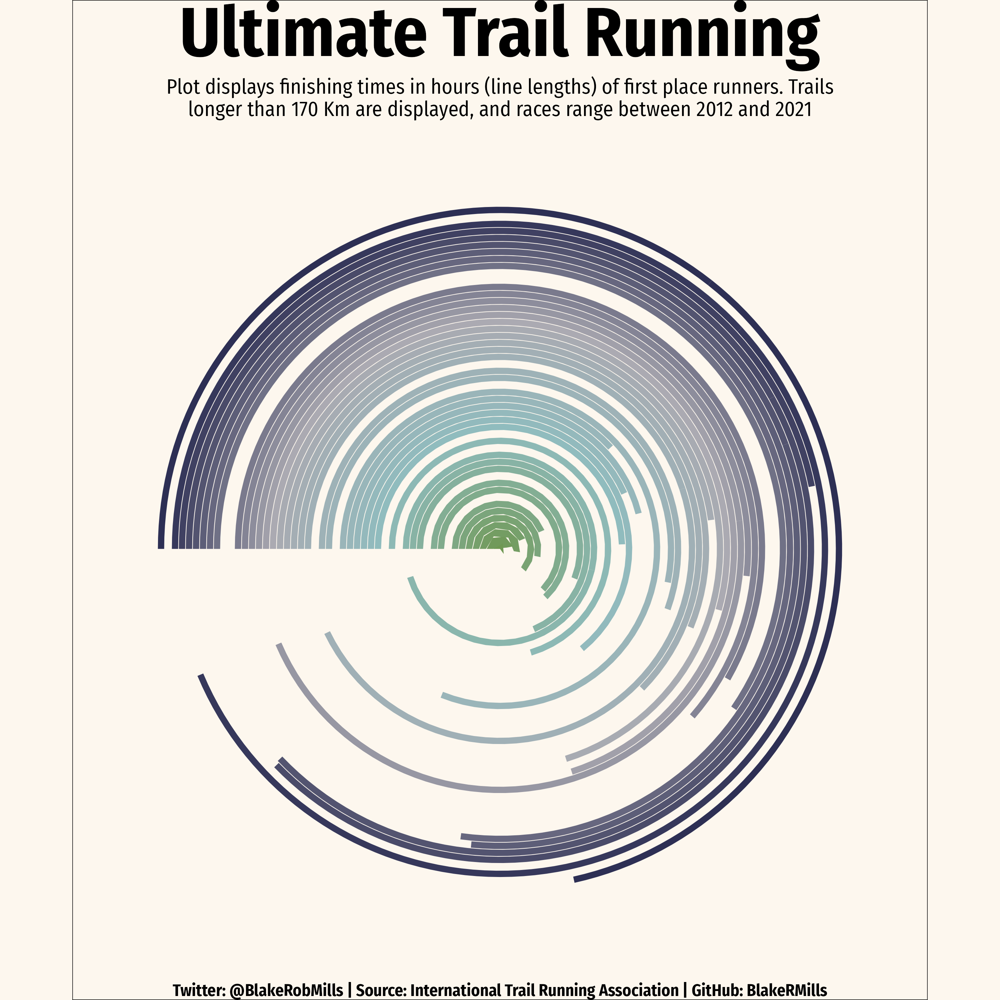

```{r setup}
knitr::opts_chunk$set(echo = TRUE, dev = "ragg_png")
suppressPackageStartupMessages({
  library(tidyverse)
  library(tantastic)
})

```

## Vizbuzz S2 E2

Goal image:



4500x4500 px

```{r import}
df_tr <- read.csv("trail_running.csv") |> 
  dplyr::filter(rank == 1) |> 
  dplyr::filter(distance > 170) |> 
  dplyr::filter(lubridate::year(lubridate::as_date(date)) >= 2012,
                lubridate::year(lubridate::as_date(date)) <= 2021) |> 
  dplyr::filter(distance <= 175) |>
  dplyr::select(rank, time, distance, time_in_seconds, race_year_id) |> 
  dplyr::arrange(distance, time_in_seconds)
```

```{r wrangle}
title <- "Ultimate Trail Running"
subtitle <- "Plot displays finishing times in hours (line lengths) of first place runners. Trails\nlonger than 170 Km are displayed, and races range between 2012 and 2021"
footer <- "Twitter: @BlakeRobMills | Source: International Trail Running Association | GitHub: BlakeRMills"
x_lab <- "Trail Distance\n(in Km)"
```

```{r plot}

color_pal <- c("#2D2F54","#ABAAB2", "#90BCBE", "#6F9853")

color_fn <- colorRampPalette(color_pal)

colours <- color_fn(length(unique(df_tr$distance)))


df_tr |>
  ggplot(
    aes(x = distance, 
        y = time_in_seconds, 
        group = race_year_id, 
        color = as.factor(distance),
        fill = as.factor(distance)
        )
  ) +
  geom_col(color = NA) + 
  coord_polar(theta="y", start = 4.71239) + 
  theme_void(base_family = "Fira Sans Condensed") + 
  theme(
    legend.position = "none",
    plot.title.position = "plot",
    plot.title = element_text(hjust = 0.5,face = "bold",size = 50),
    plot.subtitle = element_text(hjust = 0.5, size = 15),
    plot.caption = element_text(hjust = 0.5,face = "bold", size = 12),
    plot.caption.position = "plot"
    ) + 
  ylim(0, max(df_tr$time_in_seconds) + 12000) + 
  scale_x_reverse(limits = c(176,170)) +
  scale_fill_discrete(type = colours) + 
  scale_color_discrete(type = colours) + 
  labs(
    title = title,
    subtitle = subtitle,
    caption = footer,
    x_lab = x_lab
  )
  
```

```{r}
ggsave(
  filename = "submission.png", 
  device = "png", 
  width = 3000,
  height = 3000,
  units = "px",
  bg = "#FDF7EE"
)
```

Submission


