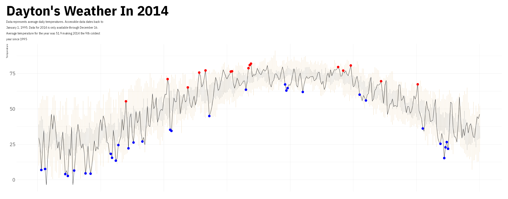

VizBuzz 2025-01
================
Tan Ho
2025-06-05

``` r
knitr::opts_chunk$set(echo = TRUE, dev = "ragg_png")
suppressPackageStartupMessages({
  library(tidyverse)
  library(tantastic)
  library(nflplotR)
  library(ggtext)
  library(ragg)
  # library(ggthemes)
  # library(ggtext)
  # library(gridtext)
  # library(ggbeeswarm)
  # library(paletteer)
  # library(ggbeeswarm)
  # library(usmap)
  # library(ggVennDiagram)
  # library(ggridges)
})
```

Resources: - <https://r-graph-gallery.com/> - colordropper

TODO: - download data - download goal plot - set as many plot variables
as possible - type out text pieces - start wrangling


``` r
dayton_raw <- readr::read_csv("dayton.csv")
```

    ## Rows: 7290 Columns: 4
    ## ── Column specification ──────────────────────────────────────────────────────────────────────────────────────────────────
    ## Delimiter: ","
    ## dbl (4): Month, Day, Year, Temp
    ## 
    ## ℹ Use `spec()` to retrieve the full column specification for this data.
    ## ℹ Specify the column types or set `show_col_types = FALSE` to quiet this message.

``` r
temp_avgs <- dayton_raw |>
  dplyr::filter(Temp > 0) |>
  dplyr::group_by(Month, Day) |>
  dplyr::summarise(
    lower = quantile(Temp, 0.25),
    upper = quantile(Temp, 0.75),
    min = min(Temp, na.rm = TRUE),
    max = max(Temp, na.rm = TRUE)
  )
dayton <- dayton_raw |>
  dplyr::filter(Year == 2014) |>
  dplyr::left_join(temp_avgs, by = c("Month", "Day")) |>
  dplyr::mutate(
    month_label = month.name[Month],
    x_value = dplyr::row_number(),
    is_max = Temp == max,
    is_min = Temp == min
  )
```

``` r
plot_height <- 960
plot_width <- 2448
plot_title <- "Dayton's Weather In 2014"
plot_subtitle <- "Data represents average daily temperatures. Accessible data dates back to

January 1, 1995. Data for 2014 is only available through December 16.

Average temperature for the year was 51.9 making 2014 the 9th coldest

year since 1995"
plot_caption <- NULL
plot_font <- NULL
plot_bg <- "#FFFFFF"
pal <- list(beige = "#EED7B1", dark_beige = "#A89F8D", blue = "#0327CD", red = "#CC2524")
```

``` r
my_plot <- dayton |>
  ggplot() +
  aes() +
  geom_segment(
    aes(y = min, yend = max, x = x_value, xend = x_value + 0.1),
    color = pal$beige
  ) +
  geom_segment(
    aes(y = upper, yend = lower, x = x_value, xend = x_value + 0.1),
    color = pal$dark_beige
  ) +
  geom_line(
    aes(x = x_value, y = Temp),
    color = "black"
  ) +
  geom_point(
    aes(x = x_value, y = Temp, alpha = is_min),
    size = 5,
    color = "blue"
  ) +
  geom_point(
    aes(x = x_value, y = Temp, alpha = is_max),
    color = "red",
    size = 5
  ) +
  labs(
    title = plot_title,
    subtitle = plot_subtitle,
    y = "Temperature",
    x = NULL
  ) +
  scale_alpha_identity() +
  scale_x_continuous(labels = NULL) +
  tantastic::theme_uv(
    base_family = "IBM Plex Sans",
    base_size = 24,
    plot_title_family = "IBM Plex Sans",
    plot_title_size = 64
  ) +
    theme(
      plot.subtitle = element_markdown()
    )

ggsave(
  plot = my_plot,
  filename = "output.png",
  device = ragg::agg_png,
  height = plot_height,
  width = plot_width,
  bg = plot_bg,
  dpi = 72,
  units = "px"
  )
```


