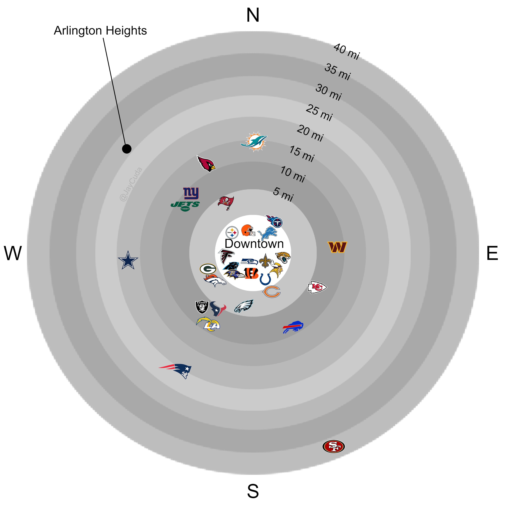

```{r setup}
knitr::opts_chunk$set(echo = TRUE, dev = "ragg_png")
suppressPackageStartupMessages({
  library(tidyverse)
  library(tantastic)
  library(ggpath)
  library(ggtext)
  library(ragg)
  library(nflplotR)
  # library(ggthemes)
  # library(ggtext)
  # library(gridtext)
  # library(ggbeeswarm)
  # library(paletteer)
  # library(ggbeeswarm)
  # library(usmap)
  # library(ggVennDiagram)
  # library(ggridges)
})
```

## Vizbuzz 08

Resources:
- https://r-graph-gallery.com/
- https://ggplot2-book.org
- colordropper extension

TODO:

- download data
- download goal plot
- set as many plot variables as possible
- type out text pieces
- start wrangling

```{r plot_vars}
plot_height <- 1024
plot_width <- 1024
plot_title <- NULL
plot_subtitle <- NULL
plot_caption <- NULL
plot_font <- NULL
plot_bg <- "#FFFFFF"
txt_labels <- list(
  arlington = "Arlington",
  downtown = "Downtown"
)
pal <- list(
  "#BDBDBD",
  "#A9A9A9",
  "#B9B9B9",
  "#CBCBCB",
  "#B9B9B9",
  "#ACACAC",
  "#9E9E9E",
  "#C6C6C6",
  "#FFFFFF"
)

```

```{r import}
df_stadium <- read.csv("nfl_stadium_downtown.csv")
df_plot <- df_stadium |>
  dplyr::select(
    team_abbr,
    stadium_coord1,
    stadium_coord2,
    downtown_coord1,
    downtown_coord2,
    distance
  ) |>
    dplyr::mutate(
      stadium_coord1 = scales::rescale(stadium_coord1)
    )
df_dist <- tibble::tibble(
  distance = c(0:8 * 5),
  stadium_coord1 = 1,
  plot_text = paste(distance, "mi"),
  fill_color = rev(c(
    "#BDBDBD",
  "#A9A9A9",
  "#B9B9B9",
  "#CBCBCB",
  "#B9B9B9",
  "#ACACAC",
  "#9E9E9E",
  "#C6C6C6",
  "#FFFFFF"
  ))
)

```

coord_polar, stacked bars, greyscale
calculate direction ?

```{r wrangle}

```

```{r plot}
plot_output <- ggplot() +
  geom_col(
    aes(x = distance, y = stadium_coord1, fill = fill_color, color = NULL),
    alpha = 1,
    data = df_dist
  ) +
  geom_nfl_logos(
    aes(x = distance, y = stadium_coord1, team_abbr = team_abbr, width = 0.05),
    data = df_plot
  ) +
  geom_text(
    aes(
      x = distance,
      y = stadium_coord1 - 0.90,
      label = plot_text,
      color = NULL
    ),
    data = df_dist
  ) +
  coord_polar(theta = "y") +
  annotate(
    geom = "text",
    x = 0,
    y = 0,
    label = "Downtown"
  ) +
  scale_fill_identity() +
  labs(
    x = NULL,
    y = NULL
  ) +
  theme_void(base_size = 60) +
  theme(
    legend.position = "none",
    axis.title = element_blank()
  )

print(plot_output)
ggsave(
  "output_plot.png",
  plot = plot_output,
  device = ragg::agg_png,
  width = plot_width,
  height = plot_height,
  dpi = 72,
  units = "px",
  bg = "#FFFFFF"
)

```


goal plot


